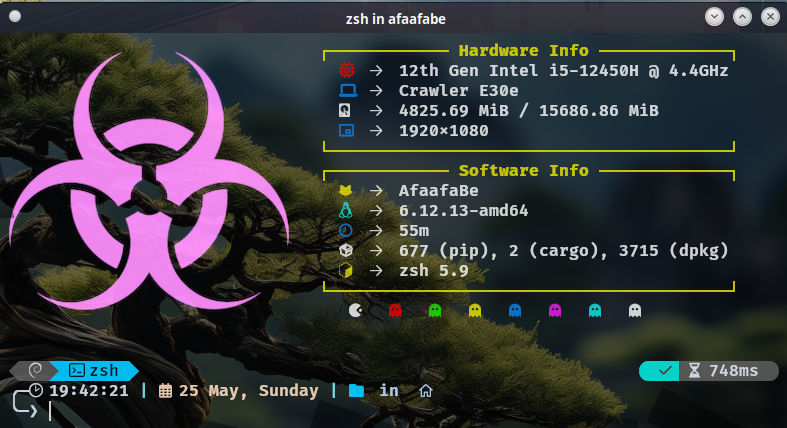

# 🎨 AfaafaBe Neofetch

Bienvenue dans la configuration **Neofetch personnalisée** pour **AfaafaBe**. 
Cette configuration affiche des informations système avec un **style visuel unique**, des **icônes** et **couleurs aléatoires**.

---

## 🖼️ Aperçu



---

## ⚙️ Fonctionnalités

- 🎲 **Icônes colorées aléatoirement** à chaque exécution
- 🖥️ Affichage : CPU, RAM, modèle, shell, uptime, etc.
- 🖼️ Utilisation d’une image à la place du logo ASCII
- 💡 Apparence moderne, cyberpunk
- 🎵 Support de l’affichage du titre de la musique en cours

---

## 🚀 Installation

1. **Cloner ce dépôt** :

```bash
git clone https://github.com/AfaafaBe/neofetch_afaafabe.git
cd neofetch-afaafabe
```

Copier la configuration Neofetch :

```bash
mkdir -p ~/.config/neofetch
cp neofetch.conf ~/.config/neofetch/config.conf
cp afaafabe1.png ~/.config/neofetch/afaafabe1.png

```
---

## 🧩 Dépendances
Neofetch

Terminal compatible image (kitty, w3m-img, ou ueberzug)

Image personnalisée (déjà incluse : afaafabe1.png)

---

## 🖌️ Personnalisation
Tu peux remplacer l’image dans la configuration :

bash
image_source="/chemin/vers/ton/image.png"
Et personnaliser l'apparence selon ton style dans neofetch.conf.

---

## 🧑‍💻 Auteur
FITAHIANTSOA Sahaza Gaëls
Créateur de AfaafaBe, passionné de cybersécurité, personnalisation système et design terminal.

---

## 🪪 Licence
Ce projet est distribué sous licence MIT.
Libre à toi de l’utiliser, modifier et partager.

---

## ⭐ Contribuer
Tu veux proposer une amélioration, une nouvelle image ou ajouter une animation ?
Fais un fork, envoie une PR ou ouvre une issue !

